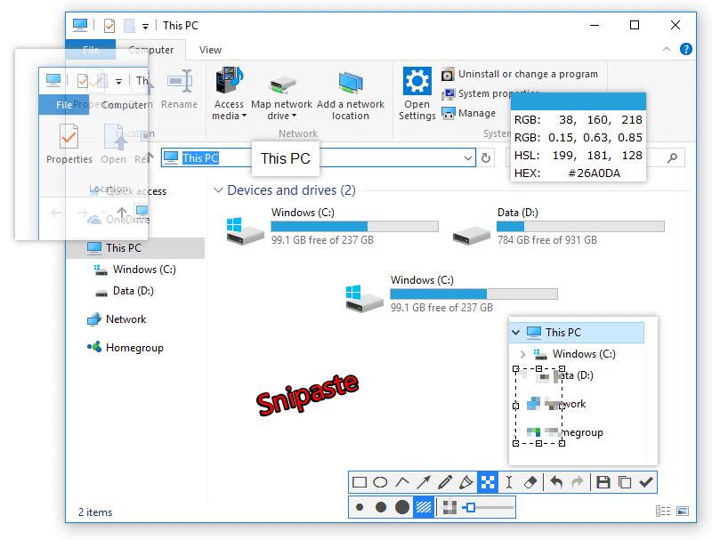

# Best App For Developer

简单、提高效率、改善生活

的 App

## Shell 终端

| 名称                                 | 简介 |
| ------------------------------------ | ---- |
| [iTerm2](https://www.iterm2.com)     |      |
| [tmux](https://github.com/tmux/tmux) |      |


### iTerm2

装完 iTerm2 之后，可以在装一下下面的东西

1. oh my zsh
2. zsh-autosuggestions（提示历史命令）

```shell
# 安装 zsh-autosuggestions
git clone git://github.com/zsh-users/zsh-autosuggestions ~/.zsh/zsh-autosuggestions
source ~/.zsh/zsh-autosuggestions/zsh-autosuggestions.zsh
```

## 命令工具

| 名称                    | 简介       |
| ----------------------- | ---------- |
| [brew](https://brew.sh) | 包管理工具 |
| fzf                     |            |
| thefuck                 |            |

## 程序切换 / 定制 / 自动化

| 名称                                                      | 简介         |
| --------------------------------------------------------- | ------------ |
| [Manico](https://manico.im)                               | 程序切换器   |
| [Alfred](https://www.alfredapp.com)                       | 提高效率神奇 |
| [Keyboard Maestro](https://www.keyboardmaestro.com/main/) | 同上         |

### Manico


是一款切换器 App，可以固定、配置 App 的顺序。

比如上面的快捷键：<br>
Chrome 就是 ⌥ + 1，vs code: ⌥ + 2，微信: ⌥ + w。当形成肌肉记忆之后，任务切换起来无比的快。

### Alfred


Alfred 的功能也是十分的强大。

1. 检索。⌥ + 空格，可以搜索应用程序，也可以搜索文件 / 文件夹（搜出的文件，鼠标拖拽至 vscode 还可直接打开）
2. workflow。可自定义 workflow 配置去代替人工的操作，例如设置各式各样的触发器，然后完成一系列动作。例如文本替换、启动 App、复制到粘贴板、执行脚本 etc.
3. Snippets。可存储一些常用的文本片段，并提供关键字快速读取并输出。常用场景如存储一些常用代码块。
4. etc

### Keyboard Maestro

能够完成上述两种 app 的功能！Keyboard Maestro 更倾向于提供各式各样的工具，让我们去使用，就像一把多功能的瑞士军刀。

比较简易的用法：使用 触发器，完成一些列动作。

简易入门指南：https://sspai.com/post/36442

## 截图 / 贴图 / 简易绘图

| 名称                                                    | 简介               |
| ------------------------------------------------------- | ------------------ |
| [Snipaste](https://zh.snipaste.com)                     | 截图 / 简画        |
| [Snagit](https://www.techsmith.com/screen-capture.html) | 截图 / 简画 / 录屏 |

### Snipaste



我比较喜欢这款截图软件的原因是，他可以将截图或粘贴板中的图片，直接生成在屏幕的最上方，就像便签一样，很是方便。（推荐去官网感受一下）

我的常用场景，是将定义的结构体生成临时便签，然后方便查看。

### Snagit

这款软件在编辑、注图的时候，非常便利，用极简的方式帮助你完成编辑图片的功能。还提供录屏的功能。

## vs code 插件

| 名称                      | 简介                           |
| ------------------------- | ------------------------------ |
| Code Spell Checker        | 英语拼写检查                   |
| Git Blame                 | 查看当前行的上个改动者         |
| Git History               | 查看 Git 历史                  |
| Markdown All in One       | 集 Markdown 大成               |
| Prettier - Code formatter | 格式化代码                     |
| Sort lines                | 选中几行进行排序               |
| Swagger Viewer            | 在编辑器中预览 Swagger         |
| filesize                  | 在底部状态栏显示当前文件的大小 |

## Chrome 插件

| 名称                                                                                                                     | 简介                              |
| ------------------------------------------------------------------------------------------------------------------------ | --------------------------------- |
| [沙拉查词](https://github.com/crimx/ext-saladict)                                                                        | 浏览器查词，可自定义多个词典      |
| [FeHelper](https://github.com/zxlie/FeHelper)                                                                            | 提供了各种 web 功能，如格式化     |
| [Stylish](https://chrome.google.com/webstore/detail/stylish-custom-themes-for/fjnbnpbmkenffdnngjfgmeleoegfcffe?hl=en-US) | 可为匹配的网站进行 css 样式的修改 |
| [Tampermonkey](https://chrome.google.com/webstore/detail/tampermonkey/dhdgffkkebhmkfjojejmpbldmpobfkfo?hl=en-US)         |                                   |

### 沙拉查词


## 在线工具

| 名称                                                             | 简介                                       |
| ---------------------------------------------------------------- | ------------------------------------------ |
| [Draw io](https://www.draw.io)                                   | 开源在线图表软件，可绘制 流程图 / ER 图 等 |
| [Process On](https://www.processon.com)                          |                                            |
| [Bundle optimize helper](https://webpack.jakoblind.no/optimize/) | webpack bundle 分析器                      |

### Draw io


开源软件，超级够用的了，因为可以导入导出各种格式的，思维导图、流程图等。

## 字体库

| 名称                                            | 简介     |
| ----------------------------------------------- | -------- |
| [Fira Code](https://github.com/tonsky/FiraCode) | 编码字体 |


地表最强编码字体，没有之一，可以结合 vscode 进行使用，当开启字体连体模式之后，即可实现，图中，左侧效果。

1. 安装字体库
2. 设置 vscode（Menu Bar -> Code -> Preferences -> Settings）

```json
{
  "editor.fontFamily": "Fira Code",
  "editor.fontLigatures": true // 启动字体连体
}
```
